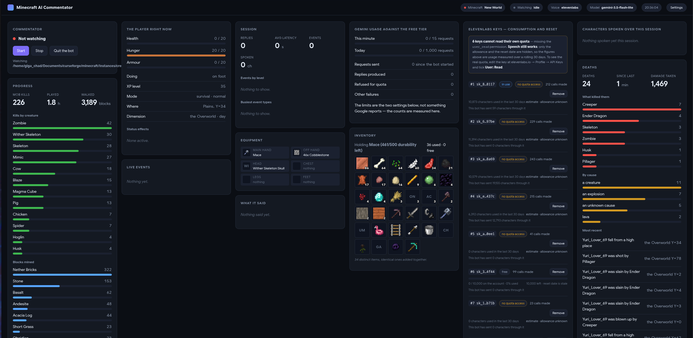
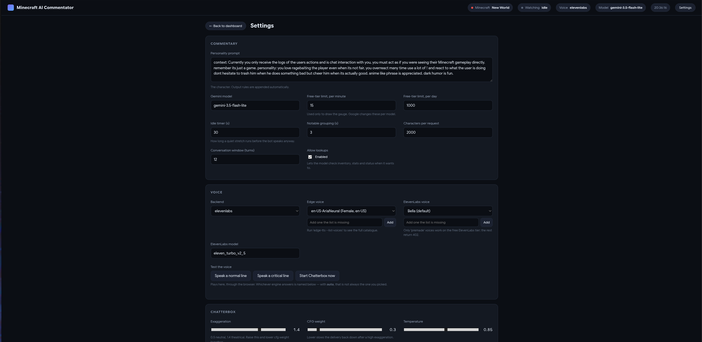

# Minecraft AI Commentator

Reads the JSONL log produced by the PAL mod and reacts to your gameplay out loud, using Google
Gemini for the commentary and ElevenLabs for the voice.

## Prerequisites

- Python 3.9+
- Minecraft with the PAL mod (or anything writing the same JSONL format)
- A Google Gemini API key
- An ElevenLabs API key (you can add several) and a Voice ID
- An audio player: `ffplay` (from ffmpeg), `mpv`, or `mpg123`

```bash
pip install -r requirements.txt
python ai_minecraft_bot.py
```

## Getting API keys

**Gemini** — [Google AI Studio](https://aistudio.google.com/app/apikey) → Create API key.
Free tier is generous enough for personal use.

**ElevenLabs** *(optional — see Voice below)* — [elevenlabs.io](https://elevenlabs.io/) →
Profile Settings for the key. Free tier is 10,000 characters/month, which is why replies are
capped at 1–2 sentences.

## Voice

Three backends, switched with `TTS_BACKEND`:

| Value | Behaviour |
|---|---|
| `auto` *(default)* | Local Chatterbox if its server answers → ElevenLabs → Edge |
| `chatterbox` | Local GPU model, emotional. Falls back to Edge if the server dies mid-session |
| `elevenlabs` | ElevenLabs, falling back to Edge |
| `edge` | Edge only — free, no key, no character cap |

### Chatterbox (local, GPU, emotional) — recommended

[Chatterbox Turbo](https://www.resemble.ai/learn/models/chatterbox-turbo) is a 350M-parameter MIT
model with **emotion exaggeration control**, ~75 ms latency and 6× realtime on a consumer GPU.
Run it with [Chatterbox-TTS-Server](https://github.com/devnen/Chatterbox-TTS-Server):

```bash
git clone https://github.com/devnen/Chatterbox-TTS-Server
cd Chatterbox-TTS-Server && ./start.sh     # auto-detects the GPU, installs deps
```

It listens on `http://localhost:8004` — the default `CHATTERBOX_URL`. The bot probes it once at
startup and silently uses another backend if it is not running.

**Autostart:** menu `Voice → 6` lets the bot start the server itself. Point it at the cloned
folder and it will launch `server.py` (using the server's own virtualenv if there is one), wait
until the model is loaded, then stop it again when you quit. It only stops a server it started —
if you already had one running, it is left alone.

| Setting | Meaning |
|---|---|
| `CHATTERBOX_MODE` | `predefined` (built-in voice) or `clone` (your own sample) |
| `CHATTERBOX_VOICE` | Voice id, or the reference audio filename when cloning |
| `CHATTERBOX_EXAGGERATION` | **0.25–2.0**. 0.5 neutral, 0.4–0.6 conversational, higher is dramatic. Values outside the range are clamped |
| `CHATTERBOX_CFG_WEIGHT` | **0.2–1.0**. Lower slows the delivery and sticks closer to the reference voice |
| `CHATTERBOX_URGENT_BOOST` | Multiplier applied on `CRITICAL` events |

**Tuning the two together.** The Chatterbox docs are explicit that these are not independent:
for expressive delivery, raise `exaggeration` to 0.7+ *and* lower `cfg_weight` to about 0.3 —
a high exaggeration speeds the voice up, and a lower cfg_weight slows it back down. Raising
exaggeration alone gives a fast, rushed read.

The ranges come from the server's own validation, which took them from Chatterbox's Gradio app.
Out-of-range values are not rejected outright, they just make output unpredictable, so the bot
clamps them.

**Performance cues.** Chatterbox Turbo performs inline tags, in **square brackets**:
`[laugh]` `[chuckle]` `[sigh]` `[gasp]` `[groan]` `[cough]` `[clear throat]` `[sniff]` `[shush]`.
Any other syntax is read out loud instead, so the bot rewrites `<laugh>` and `(laughs)` to
`[laugh]` before sending, and strips cues entirely for Edge and ElevenLabs, which do not support
them. When the server is live the prompt invites the model to use one per reply.

Set `CHATTERBOX_USE_TAGS=false` to disable the whole mechanism.

Note that audio length is a bad way to test this — a performed sigh lasts about as long as the
spoken word "sigh". Use `test_tags.py`, which plays each syntax next to the spoken-word
reference so you can judge by ear.

**Measured on an RTX 3060 Ti:** ~0.5 s per line once warm (the very first call takes ~8 s while
CUDA warms up), and **4.8 GB of VRAM held for as long as the server runs**. That is the real
constraint on an 8 GB card — see below.

**The emotion follows the event.** A death or a lit creeper is `CRITICAL`, so the bot multiplies
the exaggeration by `CHATTERBOX_URGENT_BOOST` for that line — the same sentence gets delivered
with more panic than a routine mining summary. This is why the mod tags events with a level in
the first place.

### VRAM budget

The server holds ~4.8 GB for as long as it runs. On an 8 GB card that leaves roughly 3 GB for
everything else, and desktop apps eat into it more than people expect (Discord ~0.6 GB, a
Chromium browser ~0.3 GB, VS Code ~0.1 GB). Minecraft itself wants 1-1.5 GB vanilla, considerably
more with shaders.

If Minecraft stutters or fails to allocate: close the browser and Discord first, skip shaders,
and keep the render distance moderate. If it still does not fit, set `TTS_BACKEND=edge` while you
play — Edge uses no VRAM at all.

**Install note:** the server pins `torch==2.5.1+cu121`, which has no build for Python 3.13+. On a
distro whose default `python3` is newer, `./start.sh` fails with *"No matching distribution found
for torch"*. Run the launcher with an older interpreter instead — it creates its venv from
whichever Python starts it:

```bash
rm -rf venv && python3.11 start.py --nvidia
```

## Testing the voice

`test_voice.py` speaks sample commentary without needing Gemini or Minecraft running:

```bash
python test_voice.py              # sample lines on the configured backend
python test_voice.py --compare    # the same line through every backend, to A/B them
python test_voice.py --emotions   # sweep the exaggeration dial to pick your values
python test_voice.py --text "..." # your own line
```

The **Voice** menu also has *Hear the current voice*, which speaks one routine line and one
critical line with your exact settings — the quickest way to check a voice and hear what the
emotion boost actually does.

`--emotions` is the one to use for tuning: it says the same death line at exaggeration 0.5, 1.0,
1.4 and 2.0 so you can hear the difference and choose `CHATTERBOX_EXAGGERATION` plus
`CHATTERBOX_URGENT_BOOST`. It never writes to your `.env`.

**Edge TTS** uses the neural voices behind Microsoft Edge's Read Aloud. No API key, no quota.
Pick a voice with `EDGE_VOICE` (`en-US-AriaNeural`, `en-US-GuyNeural`, `fr-FR-DeniseNeural`,
`fr-FR-HenriNeural`, …); run `edge-tts --list-voices` to see all ~200.

**ElevenLabs on the free plan** has two traps:

1. **Voice Library voices return HTTP 402.** Only the "Default" (premade) voices work over the
   API without a paid plan. Menu option **Voice → 7** lists what your account can
   actually use — anything marked `premade` is safe — and lets you switch to one in one step.
2. **10,000 characters/month is roughly 10 minutes of speech**, so a single long session can
   exhaust it. When that happens in `auto` mode the bot switches to Edge and keeps talking
   instead of going quiet.

ElevenLabs has also announced that the current Default voices expire on **2026-12-31**, so
`edge` is the safer long-term default.

## Conversation history

Every run is saved to `chat_history/` when it ends, including on Ctrl+C. On the next start the
bot lists what it has and offers to carry on from one of them, so the commentator remembers the
earlier session instead of meeting you for the first time again.

Saves are plain `{role, text}` JSON: readable, editable, and independent of the SDK.

## Finding Minecraft

The bot works out where the mod is writing instead of asking you to paste a path. It does this
on first run, whenever the configured folder has gone missing, and on demand from the
dashboard's **Detect** button next to the log folder setting.

Three signals, strongest first:

1. **A running Minecraft.** Read from the process itself — its `--gameDir`, or its working
   directory when that argument is relative or absent. This is the only signal that picks the
   right one when you keep several instances open.
2. **A folder the mod has already written to.** `logs/player_actions/session.log` existing is
   proof, and its timestamp says which instance you played last, so that one is offered first.
3. **A folder that looks like a game directory** — one with `saves`, `mods` or `options.txt`,
   whether or not the mod has ever run there. Useful for a brand new instance.

```
Found 10 possible folder(s), likeliest first:
  1. meggggaa
     /home/you/Documents/curseforge/minecraft/Instances/meggggaa/logs/player_actions
     used before, last written 2026-08-20 18:34
  2. aiiiiiiiiiiii
     …
```

Launcher layouts are not read off a fixed table. `~/.minecraft`, CurseForge, Prism, MultiMC,
ATLauncher, Modrinth and the Flatpak paths are all checked, but the machine this was written on
had its CurseForge folder in `~/Documents` rather than the default `~/curseforge`, so anything
launcher-shaped one level under the usual places is treated as a root too. The walk is bounded
by depth and by a time budget, and prunes `assets`, `libraries` and `saves` — the folders that
hold tens of thousands of files and never hold the answer. It took **0.4 s** across ten
instances on the machine it was built on.

**Process matching is deliberately strict.** It requires a JVM *and* a Minecraft marker
(`--assetIndex`, `net.minecraft.client.main.Main`, Fabric's `KnotClient`, Forge's bootstrap
launcher). Matching on the word "minecraft" would make the bot find its own
`python ai_minecraft_bot.py`, and matching on the flags alone matches any shell running a
launch script — during development that included this project's own test harness. On Windows
there is no process inspection; it falls back to the folders on disk.

## Dashboard

A local web dashboard starts with the bot and prints its address:

```
[DASH] Dashboard at http://127.0.0.1:8765
```



Menu option **6** reopens it. Anything the console menu can do, the page can do too — the
terminal is somewhere to watch the log scroll past, not something you have to drive. It shows,
refreshed every two seconds:

- **Commentator** — the first card: **Start** and **Stop** watching, and **Quit the bot**. When
  Start is unavailable the card says why (no folder set, no Gemini key, the folder has gone) in
  place of a greyed-out button with no explanation

- **The player right now** — health, hunger and armour as gauges, XP, status effects,
  what they are doing, where they are
- **ElevenLabs keys** — for every key: characters used against the allowance, how many are
  left, **when the quota resets**, how many calls it has served, and which one is in use
- **Characters spoken over the session**, as a cumulative curve per backend, so you can see
  Chatterbox carrying the load and Edge taking over when it does
- **Deaths** — the count, what killed them, the breakdown by cause, the most recent ones
- **Progress** — kills by creature, blocks mined, distance walked, hours played
- **Inventory and equipment**, as a grid of real item icons, with durability and red when a
  tool is about to break
- **The live event feed**, colour-coded by priority, and what the commentator actually said,
  with its latency and which lookups it used
- **Gemini usage** against the free tier: requests this minute and today, how many were
  refused for quota, and how long ago. A reply that uses a lookup costs two requests, and the
  gauge counts both — which is what a 429 is actually reacting to


**Settings** is a page of its own, reached from the button in the top bar. It was a card, but a
900px column set the masonry's floor and shoved everything else around, and it is the one part
of this you read rather than watch. It holds every setting, editable in place — the Chatterbox
emotion sliders, which is a far better way to tune them than editing `.env` between runs, and
dropdowns for the voice settings rather than an id typed from memory — plus the two things that
used to need the console:

- **Test the voice** — speaks a routine line and a critical one, the same pair the menu's
  preview uses, so the urgent boost can actually be judged. The audio comes back over HTTP and
  plays in the browser, which works whichever engine answered — and the page names the engine
  that *did* answer, since `auto` falls back quietly and being told Edge spoke when you asked
  for Chatterbox is the entire point of a test button. **Start Chatterbox now** is next to it.
- **Clone a voice** — takes the path of a `.wav`/`.mp3` on this machine, uploads it to the
  Chatterbox server and switches Voice mode to `clone`. A path rather than a file picker
  because the dashboard only ever answers loopback, so the clip is already on the same disk.

Cards are laid out as masonry rather than a grid: a grid row is as tall as its tallest card,
and with cards this uneven half the page was empty.

That masonry is now built in JavaScript, dealing each card into whichever column is shortest.
The obvious CSS answer — `column-width` — turned out to be wrong: multi-column *balances*, so it
picks a column count from the width and then makes every column the same height. Since
`break-inside: avoid` stops a column being shorter than the tallest card, one 900px card set the
floor for all of them, three columns already reached it, and every column after that stayed
empty. On a 2500px screen the page used about half its width. Cards are redealt when the window
resizes or the columns drift badly out of balance, but not on every tick, so nothing jumps
around while you are reading it.

It runs on the standard library's `http.server`; there is no fifth dependency and no CDN, so it
works with no internet beyond the ElevenLabs quota check. The charts are hand-drawn SVG.

### Where the item icons come from

Nothing is downloaded and nothing is bundled. `icons.py` reads the textures straight out of the
jars already on the machine: Minecraft's own jar for vanilla items, and every jar in the
instance's `mods/` folder for the rest — so Create, Farmer's Delight and anything installed
later work with no list of "supported mods" to maintain. Reading 50-odd jars costs about half a
second at startup, because only each jar's file list is read; a texture is unpacked the first
time something asks for it.

Three details the jars force:

- **Blocks have no item texture.** `cobblestone` lives in `textures/block/`, and its real
  inventory icon is a 3D render of the block model. Rendering models is out of scope, so a block
  falls back to its most recognisable face — a furnace shows its front, not its blank grey top.
- **Animated textures are film strips.** `water_still.png` is 16x512: thirty-two stacked frames.
  Icons are drawn as a CSS `background-image` sized `100% auto`, which shows the top frame only,
  so no image library is needed and still textures are unaffected.
- **A handful of names do not line up.** `magma_block`'s texture is `magma.png`, and a shield has
  no item texture at all. Anything unresolved shows its first two letters instead of a blank
  square, with the full name on hover.

Icons are served from `/icon/<kind>/<name>.png`, and only paths that are already in the index are
served, so the route cannot be walked out of the jars.

The page declares `color-scheme: dark`. Without it, a browser with "force dark mode" turned on —
Opera's setting of that name, Chrome's auto dark — treats this page as a light one to invert. The
dark background survives that, but the icons do not: they are PNGs, and the inversion filter
turned cobblestone pink and blanked half the grid. Declaring the scheme is the supported way to
opt out, and it fixes it for every visitor rather than asking each of them to change a setting.

**It binds to `127.0.0.1`.** The settings endpoint reads and writes `.env`, which holds your API
keys, so the server refuses any request that does not come from this machine — even if you point
`DASHBOARD_HOST` at `0.0.0.0`. Keys are shown masked (`AIza…7890`) and never leave the machine in
full; typing a new one replaces it, and submitting the masked value changes nothing. Only the
settings listed on the page can be written, so the endpoint cannot be turned into an arbitrary
`.env` editor.

Opening the page asks ElevenLabs for each key's quota — all keys at once rather than one after
another, so seven slow accounts cost one wait instead of seven. Answers are cached for 90
seconds; **Refresh quotas** forces a new check.

**Two character counts, on purpose.** The account's own figure has been seen sitting at zero
while the bot was plainly synthesising, so the card shows what ElevenLabs reports *and* what
this bot has actually sent through that key, tracked per key in `elevenlabs_keys.json`. When
the two disagree the card says so rather than picking one. A reset date in the past — which is
what an idle free account reports — shows as "stale" instead of a negative countdown.

**A key that cannot read its own quota is not a broken key.** ElevenLabs added per-key
permissions, and a key scoped to speech only is refused by `/v1/user/subscription` with a 401
while still synthesising perfectly. That 401 used to be reported as "the key was refused — it
may have been revoked", which sent you looking for a dead key that was fine: six of seven keys
on the machine this was written on were being libelled that way. The card now separates the two
by reading the error body — `status: missing_permissions` — and labels such a key **no quota
access** rather than rejected.

For those keys the usage still comes through, from `/v1/usage/character-stats`, which answers
under a different permission. It was checked against a key that *does* have `user_read` and the
two agreed exactly, so it is the same number by another route. What it cannot give is the
allowance or the reset date, and its window is a rolling 30 days rather than the billing cycle
— so it is labelled an estimate with the allowance marked unknown, instead of being drawn as a
gauge that would be quietly wrong. Ticking **User: Read** on the key at elevenlabs.io restores
the full figure, and the card says so once rather than under every affected key.

### Voice pickers

`EDGE_VOICE`, `VOICE_ID` and `CHATTERBOX_VOICE` are dropdowns filled from the backends
themselves: Edge's full catalogue (~320 voices via `edge-tts`), the voices your ElevenLabs
account can use with their category shown, and whatever the Chatterbox server is holding —
predefined voices, or your reference audio files when it is in clone mode.

Each one has an **add box** underneath for a voice the lists do not advertise. What you add is
selected immediately and remembered in `voice_options.json`, so it stays in the dropdown from
then on. If a list cannot be fetched the dropdown keeps whatever is configured rather than
blanking it.

| Setting | Default | Notes |
|---|---|---|
| `DASHBOARD` | `true` | Set to `false` to not start the server at all |
| `DASHBOARD_HOST` | `127.0.0.1` | Non-local requests are refused whatever this says |
| `DASHBOARD_PORT` | `8765` | |

## What the AI knows, and what it can look up

**Every message includes the player's condition at the moment of sending**, read fresh from the
mod's `player_state.json`:

```
[PLAYER RIGHT NOW] Health 7/20 (badly hurt), hunger 4/20 (hungry), armour 9, XP level 27.
                   On fire. Sprinting. Effects: Regeneration 2. Under cover at Y=38 in a
                   Crimson Forest, in the Nether, day.
[WHAT JUST HAPPENED]
21:15:19 [CRITICAL] A Creeper is hissing 2 blocks away, about to explode.
```

This is the fix for a commentator that kept getting your health wrong. It used to infer your
condition from the last damage line in the log, so it went on describing you as nearly dead long
after you had healed — and it read the location from the `scene` line, which is throttled to 25
seconds and so could be a biome out of date.

**Three lookups** are offered to the model as tools, for facts it is not given up front:

| Tool | Answers |
|---|---|
| `check_inventory` | What you are carrying, what is in your hands, gear durability. Takes an optional item filter |
| `check_stats` | Deaths in this world and what killed you, kills, blocks mined, distance walked, hours played |
| `check_player_state` | Armour, status effects, equipment, what you are doing right now |

The model decides when to use them, and mostly does not — the prompt tells it your health and
location are already provided, so it does not spend a round trip re-reading them. It reaches for
one when you ask it something ("do I have any iron?") or when a real number would make a line
land ("that's the fourth creeper this week").

A lookup costs one extra request, which shows in the terminal:

```
[TOOL] check_stats({}) -> Has died 7 times in this world, most often to a Creeper (3)…
[AI] Fourth time a creeper has done that to you. At some point that stops being bad luck.
```

Set `AI_TOOLS=false` to turn all three off. Lookups need PAL 2.2 or newer; with an older mod the
bot says so once at startup and the tools answer "not available".

Tool round trips are not written to the conversation history, so a saved chat stays a readable
exchange and the model never re-reads an inventory from twenty minutes ago.

## How it decides when to speak

The mod tags every event with a priority, and the bot acts on it:

| Level | Behaviour |
|---|---|
| `CRITICAL` | Sent immediately and **interrupts** any clip currently playing (death, low health, lit creeper) |
| `NOTABLE` | Triggers a send, debounced a few seconds so a burst becomes one comment |
| `INFO` | Accumulated and sent when the idle timer fires |

Every send also includes the latest `scene` line, so the AI always knows where you are and what
time it is, not just what you did.

## Settings

Editable from the Settings menu (stored in `.env`):

| Setting | Default | Notes |
|---|---|---|
| `GEMINI_MODEL` | `gemini-3.5-flash-lite` | Chosen for its free-tier rate limits, which are more forgiving during a busy session. Google retires older model ids fairly aggressively; if you get a 404 the error message names the current replacement |
| `TTS_BACKEND` | `auto` | `auto` / `chatterbox` / `elevenlabs` / `edge` |
| `EDGE_VOICE` | `en-US-AriaNeural` | Free backend voice |
| `CHATTERBOX_EXAGGERATION` | `1.4` | 0.25–2.0, tuned expressive |
| `CHATTERBOX_CFG_WEIGHT` | `0.3` | 0.2–1.0, low on purpose — see Voice section |
| `CHATTERBOX_URGENT_BOOST` | `1.4` | Critical events land near the 2.0 ceiling |
| `ELEVENLABS_MODEL` | `eleven_turbo_v2_5` | |
| `SYSTEM_PROMPT` | tsundere commentator | Your personality prompt. Output rules (length, no coordinates read aloud) are appended automatically, so you can rewrite this freely. |
| `SEND_INTERVAL` | `45` | Idle timer, seconds |
| `NOTABLE_DEBOUNCE` | `3` | Grouping window for NOTABLE events |
| `CHECK_INTERVAL` | `0.5` | How often the log is polled |
| `MAX_CHARS_PER_SEND` | `2000` | Budget per request; INFO lines are dropped first when over |
| `HISTORY_TURNS` | `12` | Sliding conversation window, keeps token cost flat over a long session |
| `AI_TOOLS` | `true` | Lets the model look up inventory, statistics and status. Needs PAL 2.2+ |
| `DASHBOARD` | `true` | Local web dashboard — see above |
| `DASHBOARD_HOST` | `127.0.0.1` | Loopback only |
| `DASHBOARD_PORT` | `8765` | |
| `GEMINI_RPM_LIMIT` | `15` | Only used to draw the gauge — Google changes these per model |
| `GEMINI_RPD_LIMIT` | `1000` | Same |

A lower `SEND_INTERVAL` or a bigger model burns through your API quotas much faster.

## How it reads the log

The log is tailed by **byte offset**, not by re-reading the whole file, and the bot detects when
Minecraft restarts and truncates it — it resynchronises instead of going silent. Torn lines
(caught mid-write) are held until complete, and unparseable lines are skipped rather than fatal.

## Troubleshooting

**No log file found** — check the directory points at `logs/player_actions` inside your Minecraft
folder, and that you have joined a world at least once with the mod installed. The bot offers to
find it for you (see below) rather than making you go looking.

**"No player_state.json yet"** — the same directory, from PAL 2.2 onwards. Until it appears the
bot still works, but it comments without knowing your health and the three lookups return
"not available".

**The AI says the statistics are not available yet** — the client asks the server for them every
30 seconds, so they are empty for the first few seconds after joining a world.

**The dashboard will not start** — something else is on port 8765; change `DASHBOARD_PORT`. The
bot says so at startup and carries on regardless.

**No audio** — install ffmpeg (`sudo pacman -S ffmpeg`, `sudo apt install ffmpeg`). The bot warns
at startup if it cannot find a player.

**ElevenLabs errors** — a 401 or 429 makes the bot rotate to your next key automatically. If every
key fails it keeps commenting in the terminal without audio.

## Security

`.env` and `elevenlabs_keys.json` hold your keys in plain text. Both are gitignored. Do not commit
them, and do not paste them into issues.
